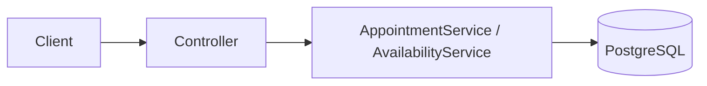
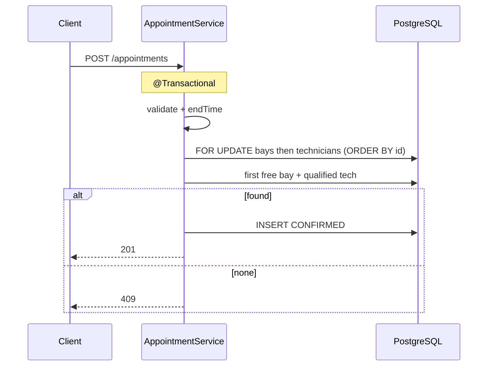

# System Design Document

**Product:** Appointment Scheduler (Scenario A — Unified Service Scheduler)  
**Domain:** Ownership · **Stack:** Spring Boot 3, JPA, PostgreSQL, Gradle  
**Deliverable 1** — Working code & AI narrative: [README.md](../README.md)

---

## 1. Requirements → design

| # | Brief requirement | Design response |
|---|-------------------|-----------------|
| 1 | Book by vehicle, service type, dealership, desired time | `POST /api/appointments` |
| 2 | Check ServiceBay + **qualified** Technician for full duration | `POST /api/appointments/availability` + allocate on book |
| 3 | Persist confirmed record (customer, vehicle, tech, bay) | `Appointment` with status `CONFIRMED` |

Rules:

- `endTime = desiredStartTime + serviceType.durationMinutes`
- Qualified tech = row in `technician_skills`
- Only `CONFIRMED` appointments block capacity (overlap)

**In scope:** 2 APIs, domain model, pessimistic lock on book, seed, tests, Docker.  
**Out of scope:** UI, auth, cancel/list APIs, queue / rate-limit for extreme load.

---

## 2. Architecture



| Layer | Role |
|-------|------|
| Controller | HTTP, `@Valid`, errors via `GlobalExceptionHandler` |
| Services | Validate, capacity check, lock + allocate, persist |
| JPA / PostgreSQL | Entities, overlap queries, `SELECT … FOR UPDATE` on book |

**Deploy:** `docker compose` → `postgres` + `api` (:8080).

---

## 3. Database diagram


**Notes**

- `appointments` is the hub (customer, vehicle, dealership, bay, technician, service type, time, status).
- `technician_skills` implements “qualified technician” (Req 2).
- `CONFIRMED` consumes bay/tech; `CANCELLED` does not (soft cancel ready, API not exposed).

---

## 4. API

Base: `http://localhost:8080`

**Request (both endpoints):**

```json
{
  "customerId": "<uuid>",
  "vehicleId": "<uuid>",
  "serviceTypeId": "<uuid>",
  "dealershipId": "<uuid>",
  "desiredStartTime": "2026-08-15T09:00:00Z"
}
```

| Endpoint | Result |
|----------|--------|
| `POST /api/appointments/availability` | `200` + `{ available, requestedTime, serviceType, capacity }` |
| `POST /api/appointments` | `201` confirmed appointment, or `409` if no free bay+tech |

`available` requires both free technicians and free bays &gt; 0. Max concurrent jobs ≈ `min(techs, bays)`.

Errors: `400` validation / ownership / past time · `404` unknown id · `409` slot unavailable.

---

## 5. Core flows

### Availability (no lock)

Validate → compute `endTime` → count free active bays and qualified techs without overlap → return capacity.

### Book (pessimistic lock)



**Overlap:** `existing.start < new.end AND existing.end > new.start` (per bay and per technician).

Locks held until commit; stable `id` order avoids deadlock. Availability stays unlocked (hint only).

---

## 6. Concurrency choice

| Option | Verdict |
|--------|---------|
| Check-then-act only | Unsafe under parallel books |
| **Pessimistic `FOR UPDATE` on book** | **Chosen** — prevents double-book |
| Lock only one pair / DB exclusion / queue | Possible later; out of assessment scope |

Example: 3 bays + 2 oil-qualified techs → at most **2** Oil Change at the same time; third book → 409.

---

## 7. Technology & delivery

| Area | Choice |
|------|--------|
| Java 17 / Spring Boot 3.3 / JPA | Fast, clear REST + persistence |
| PostgreSQL 16 | Durable + `FOR UPDATE` |
| Gradle + Docker Compose | Reproducible demo |
| JUnit + H2 tests | Book / double-book / concurrent scarce skill |

Seed on first empty DB (`DataSeeder`). Tests do not use the Docker volume.

---

## 8. Scalability & Future Architecture

The current implementation is intentionally designed as a **modular monolith** to satisfy the assessment requirements while remaining easy to maintain. As the platform grows, the architecture can evolve incrementally without changing the core booking business logic.

### Phase 1 — Assessment / Small Scale

```text
             Client
                │
         Spring Boot API
                │
        PostgreSQL Primary
```

Characteristics

- Single Spring Boot application
- Single PostgreSQL database
- ACID transactions
- Pessimistic locking for booking
- Suitable for small and medium dealerships

---

### Phase 2 — Horizontal Application Scaling

```text
                 Load Balancer
                       │
      ┌────────────────┼────────────────┐
      │                │                │
   API Pod 1       API Pod 2       API Pod 3
      │                │                │
      └────────────────┼────────────────┘
                       │
               PostgreSQL Primary
```

Changes

- Stateless Spring Boot application
- Kubernetes Horizontal Pod Autoscaler
- HikariCP connection pool
- Proper database indexing
- Short-lived transactions

Although multiple application instances exist, every booking transaction still coordinates through the same PostgreSQL database. Pessimistic locking continues to prevent double booking.

---

### Phase 3 — Read Scaling

```text
                   API Pods
                       │
          ┌────────────┴────────────┐
          │                         │
      Redis Cache          PostgreSQL Cluster
                                 │
                    Primary + Read Replicas
```

Redis caches relatively static reference data:

- Service Types
- Dealership information
- Technician skills
- Business hours

Read replicas serve read-only APIs such as:

- Appointment history
- Vehicle lookup
- Dealership information

Booking requests are always routed to the Primary database to guarantee transactional consistency.

Appointment availability is intentionally **not cached**, because stale data may lead to incorrect booking suggestions.

---

### Phase 4 — Event-Driven Integration

```text
              Appointment Service
                      │
               PostgreSQL Primary
                      │
                 Outbox Table
                      │
                     Kafka
                      │
      ┌───────────────┼────────────────┐
      │               │                │
 Notification      Audit Log      Analytics
```

Appointment creation remains a synchronous transaction.

Kafka is used only for asynchronous processing, including:

- Email notifications
- SMS notifications
- Audit logging
- Analytics
- External system integration

This ensures failures in downstream systems do not affect the booking transaction.

---

### Phase 5 — Scaling to 1 Million Users

```text
                        API Gateway
                             │
          ┌──────────────────┼──────────────────┐
          │                  │                  │
  Appointment Pods   Availability Pods   Future Services
          │                  │
          └──────────────────┼──────────────────┘
                             │
                       Redis Cluster
                             │
                 PostgreSQL Cluster
            Primary + Multiple Read Replicas
                             │
                 Database Sharding (Future)
                             │
                           Kafka
```

At enterprise scale, the architecture evolves with the following improvements:

#### Horizontal Scaling

Application instances remain stateless and can be scaled independently behind a Load Balancer.

#### Primary / Replica Database

- All booking transactions are executed on the Primary database.
- Read-only APIs are served from Read Replicas.
- This significantly reduces read pressure while preserving strong consistency for booking.

#### Database Sharding

When the number of dealerships becomes very large, data can be partitioned by Dealership.

```text
Dealer A  → Database A

Dealer B  → Database B

Dealer C  → Database C
```

Each booking transaction locks only resources within its own dealership, greatly reducing lock contention and improving scalability.

#### Redis Cluster

Redis stores only relatively static reference data.

It is **not** the source of truth for appointment booking. Transaction consistency is always guaranteed by PostgreSQL.

#### Concurrency Strategy

Every booking follows the same transactional flow:

1. Begin transaction
2. Lock candidate Service Bays (`FOR UPDATE`)
3. Lock candidate Technicians (`FOR UPDATE`)
4. Verify no overlapping appointments exist
5. Create Appointment
6. Commit transaction

Transactions are intentionally kept short to minimize lock contention, allowing multiple application instances to process bookings concurrently.

---

### Future Improvements

- Appointment cancellation and rescheduling
- Distributed cache invalidation
- Rate limiting
- OpenTelemetry distributed tracing
- Circuit breakers
- Idempotency keys
- Dead Letter Queue
- Auto-scaling based on CPU and request throughput

## 9. Limitations

- The current implementation locks all candidate bays and technicians within a dealership during booking. This keeps the implementation simple but reduces concurrency under very high contention.
- Availability results are advisory only. Another booking may succeed before the user submits the final booking request.
- No authentication or authorization.
- No appointment cancellation or rescheduling API.
- No asynchronous notification pipeline (future enhancement via Outbox + Kafka).

---

## Summary

Two REST endpoints, resource model (bay + skilled technician over a time range), PostgreSQL, and pessimistic locks on the write path — mapped directly to Scenario A’s three requirements.
